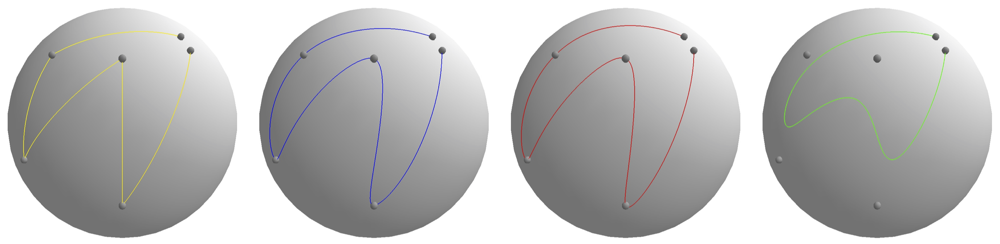
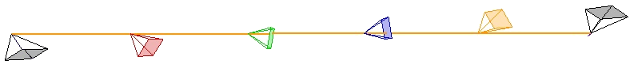

# interpolation-methods

Haarbach, Adrian, Tolga Birdal, and Slobodan Ilic. ["Survey of higher order rigid body motion interpolation methods for keyframe animation and continuous-time trajectory estimation."](doc/haarbach2018survey.pdf) 2018 International Conference on 3D Vision (3DV). IEEE, 2018:

> Since animation techniques are best explored interactively, we provide our web and C++ applications to interact with and visualize Euclidean, orientation and rigid body motion interpolation methods that produced all our figures and runtime evaluations as well as an overview table of all methods: http://adrian-haarbach.de/interpolation-methods.

The `src` directory contains the C++ implementation of our trajectory representations which uses [Eigen3/{Dense,Geometry}](http://eigen.tuxfamily.org) as templated Matrix and Quaternion basis and [GLFW](http://www.glfw.org/) for the visualization.


## Overview

The following methods are provided

Euclidean interpolation:
* LERP
* cubic Bezier Spline based on [ttk592/spline](https://github.com/ttk592/spline)
* cubic B-Spline in Matrix basis and cumulative form

Orientation interpolation:
* QLB/LERPN (Quaternion Linear Blending == renormalized LERP)
* SLERP in SU(2) `expq`, `logq` of `QuaternionMapping.h` from [hengli/vmas-ros-pkg/calibration/hand_eye_calibration](https://github.com/hengli/vmav-ros-pkg/tree/master/calibration/hand_eye_calibration/include/hand_eye_calibration)
* SQUAD (Shoemake '87)
* RQBEz (Renormalized quaternion Bezier curve)
* Cumulative B-spline curve (CuBsp) in SU(2) (Kim, Kim, Shin '95)

Rigid body motion interpolation based on cubic B-Spline in combination with:
* R(3)xSO(3)/SPLIT interpolation
* DH (Dual Quaternion) based on `DualQuaternion.h` from [hengli/vmas-ros-pkg/calibration/hand_eye_calibration](https://github.com/hengli/vmav-ros-pkg/tree/master/calibration/hand_eye_calibration/include/hand_eye_calibration)
* SE(3) based on `sophus/se3.hpp` from [strasdat/Sophus](https://github.com/strasdat/Sophus.git)


## Installation

### Dependencies
 * [cmake](https://cmake.org/)
 * [Eigen3](http://eigen.tuxfamily.org)
 * [glfw](http://www.glfw.org/)

#### Mac OSX

Install dependencies via [homebrew](https://brew.sh) package manager:
```sh
brew install cmake eigen glfw
```

#### Ubuntu

Install dependencies via apt:
```sh
sudo apt install cmake libeigen3-dev libglfw3-dev
```

### Building
```sh
git checkout https://github.com/adrelino/interpolation-methods.git
cd interpolation-methods
git submodule update --init

mkdir build && cd build
cmake -DCMAKE_BUILD_TYPE=Release ../src/
make
```


## Execution

To reproduce the 3D visualizations and runtime experiments from sections 4, 5 and 6 of the paper.

### 4. Orientation interpolation methods

This will display the rotation part of the trajectories on the surfaces of a unit quaternions sphere.

```sh
./app_runtime/vis-orientation
```



This allows e.g. to generate
> Figure 4: Comparison of orientation interpolation methods on the surface of the sphere S^2 and by the norm of their angular velocity su(2).

### 5. Rigid body motion interpolation methods

This will display the rotation part of the trajectories as an animated camera frustrum and the translation part as a line in 3D Euclidean space.

```sh
./app_visualization/vis-rigid 
```



This allows e.g. to generate
> Figure 5: Interpolation of two poses   / Figure 6: Trajectory from 4 poses

### 6. Runtime experiments

To re-run the runtime experiments, run

```sh
./app_runtime/rigid-pairwise
...
=====  TIMINGS ===== multip ===== ops=10001
name      	nsec	max 	min 	SPLIT	#means
QLB+LERP  	11.98 	0.06 	1.00 	0.13	1000	
DLB       	22.76 	0.11 	1.90 	0.26	1000	
SPLIT     	88.84 	0.44 	7.42 	1.00	1000	
ScLERP    	131.27 	0.64 	10.96 	1.48	1000	
SE3Up     	204.00 	1.00 	17.03 	2.30	1000	
```
and
```sh
./app_visualization/vis-rigid 
...
=====  TIMINGS ===== Trajectories ===== ops=10001
name      	nsec	max 	min 	CuBsp	#means
DLFus     	175.94 	0.24 	1.00 	0.50	10	
CuBsp     	353.50 	0.48 	2.01 	1.00	10	
ScFus     	448.13 	0.61 	2.55 	1.27	10	
SQUAD     	643.04 	0.87 	3.65 	1.82	10	
SpFus     	738.24 	1.00 	4.20 	2.09	10	
```

This allows e.g. to generate
> Table 2: Runtime for pairwise (left) and higher order (right) rigidbody motion interpolation.
