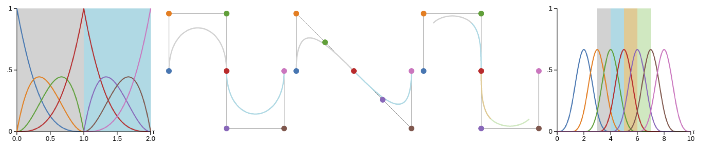

# Survey of Higher Order Rigid Body Motion Interpolation Methods for Keyframe Animation and Continuous-Time Trajectory Estimation

[3DV 2018](http://3dv18.uniud.it/)

[Adrian Haarbach](http://www.adrian-haarbach.de), [Tolga Birdal](http://tbirdal.me/), [Slobodan Ilic](http://campar.in.tum.de/Main/SlobodanIlic)

[Technische Universität München, Germany](http://tum.de) & [Siemens AG, Munich, Germany](http://siemens.com)

  

## Abstract:
In this survey we carefully analyze the characteristics of higher order rigid body motion interpolation methods to obtain a continuous trajectory from a discrete set of poses. We first discuss the tradeoff between continuity, local control and approximation of classical Euclidean interpolation schemes such as Bezier and B-splines. The benefits of the manifold of unit quaternions SU(2), a double-cover of rotation matrices SO(3), as rotation parameterization are presented, which allow for an elegant formulation of higher order orientation interpolation with easy analytic derivatives, made possible through the Lie Algebra su(2) of pure quaternions and the cumulative form of cubic B-splines. The same construction scheme is then applied for joint interpolation in the full rigid body pose space, which had previously been done for the matrix representation SE(3) and its twists, but not for the more efficient unit dual quaternion DH1 and its screw motions. Both suffer from the effects of coupling translation and rotation that have mostly been ignored by previous work. We thus conclude that split interpolation in R3 × SU(2) is preferable for most applications. Our final runtime experiments show that joint interpolation in SE(3) is 2 times and in DH1 1.3 times slower - which furthermore justifies our suggestion from a practical point of view.

## Downloads:
[Paper](doc/haarbach2018survey.pdf) | [BibTex](doc/haarbach2018survey.bib)

## Video:
<link type="text/css" rel="stylesheet" href="doc/style.css" />

    <iframe width="560" height="315" src="https://www.youtube.com/embed/rT7xn7cYlvI" frameborder="0" allow="autoplay; encrypted-media" allowfullscreen></iframe>

## Overview Table:
<iframe width="100%" height="700px" src="https://docs.google.com/spreadsheets/d/e/2PACX-1vRjEd2zgFgVCXUL2GkEUxE2mD7HLkCMF0x7wBGbA0Dd3q1NNsWTVWbnYgddNpD4RGMA1W24QYn_V58Z/pubhtml?widget=true&amp;headers=false"></iframe>